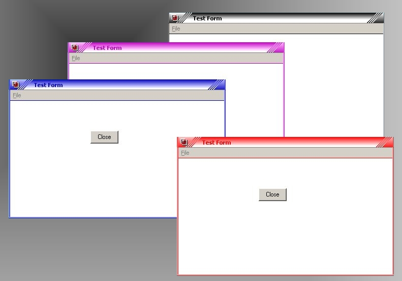



## ANSkin

### Description

ANSkin is a ActiveX control to Skinning your VB Form easily and practice..

You only just load a ANSkin into your form and run it..

A..Ha.... Your form now skinned automatically...

ANSkin feature include System Menu, but i do not add a control button on it

Please try it and make your Application nice and beautifull.......

Dont forget to vote me and give your feedback for future reference for me to developed this activex

Sorry for my English.........:~)
 
### More Info
 

             |
---                |---
**Submitted On**   |2007-10-04 21:40:02
**By**             |[Anwar effendi](https://github.com/Planet-Source-Code/PSCIndex/blob/master/ByAuthor/anwar-effendi.md)
**Level**          |Intermediate
**User Rating**    |4.5 (18 globes from 4 users)
**Compatibility**  |VB 6\.0
**Category**       |[Custom Controls/ Forms/  Menus](https://github.com/Planet-Source-Code/PSCIndex/blob/master/ByCategory/custom-controls-forms-menus__1-4.md)
**World**          |[Visual Basic](https://github.com/Planet-Source-Code/PSCIndex/blob/master/ByWorld/visual-basic.md)
**Archive File**   |[ANSkin2085951042007\.zip](https://github.com/Planet-Source-Code/anwar-effendi-anskin__1-69440/archive/master.zip)

